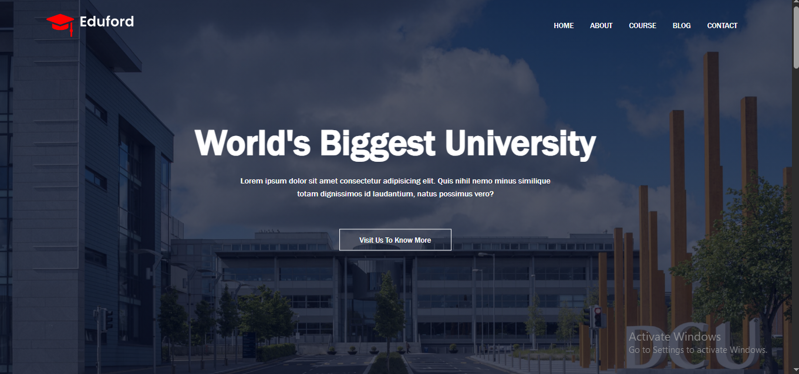
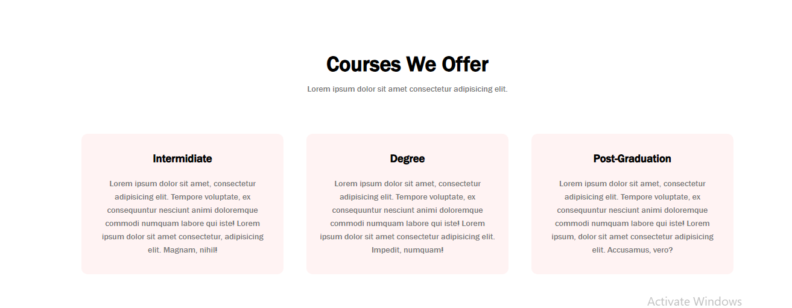
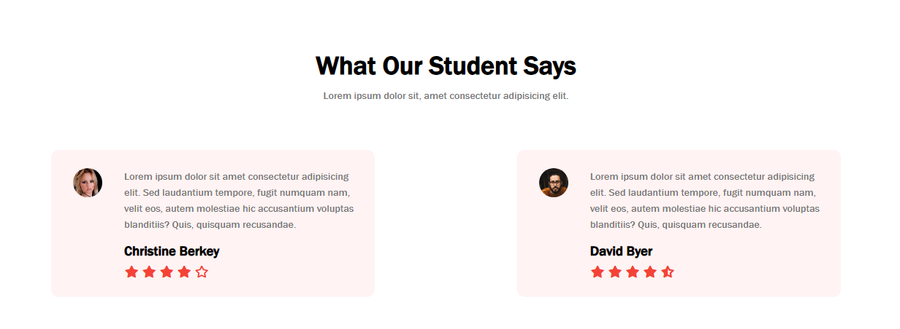
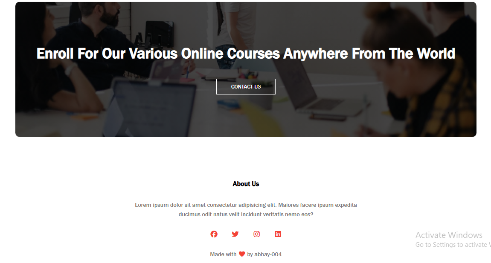

# 📘 Responsive Education Website  

A simple and responsive **Education Website** built using **HTML & CSS**.  
This project demonstrates how to create a clean, modern, and mobile-friendly website layout without using any external frameworks.  

## 🌐 Live Demo

👉 [View Live Demo](https://responsive-website-004.netlify.app/src/)  

## 📸 Preview

## 🛠️ Technologies Used

- **HTML5** – for website structure  
- **CSS3** – for styling and responsive design (Flexbox & Grid used)  

## 🎮 Features

Responsive design (works on mobile, tablet, and desktop)  
- Clean and minimal UI  
- Hero section with call-to-action  
- Courses/Programs section  
- About section  
- Contact form  
- Footer with useful links 